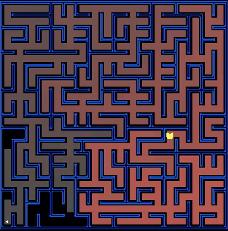

# Project 1: Search

<p align="center">
	
	All those colored walls, Mazes give Pacman the blues, So teach him to search.
</p>


------

## Introduction

In this project, your Pacman agent will find paths through his maze world, both to reach a particular location and to collect food efficiently. You will build general search algorithms and apply them to Pacman scenarios.

This project includes an autograder for you to grade your answers on your machine. This can be run with the command:

```shell
python autograder.py
```


The code for this project consists of several Python files, some of which you will need to read and understand in order to complete the assignment, and some of which you can ignore.

| **Files you'll edit:**               |                                                              |
| ------------------------------------ | ------------------------------------------------------------ |
| `search.py`                          | Where all of your search algorithms will reside.             |
| `searchAgents.py`                    | Where all of your search-based agents will reside.           |
| **Files you might want to look at:** |                                                              |
| `pacman.py`                          | The main file that runs Pacman games. This file describes a Pacman GameState type, which you use in this project. |
| `game.py`                            | The logic behind how the Pacman world works. This file describes several supporting types like AgentState, Agent, Direction, and Grid. |
| `util.py`                            | Useful data structures for implementing search algorithms.   |
| **Supporting files you can ignore:** |                                                              |
| `graphicsDisplay.py`                 | Graphics for Pacman                                          |
| `graphicsUtils.py`                   | Support for Pacman graphics                                  |
| `textDisplay.py`                     | ASCII graphics for Pacman                                    |
| `ghostAgents.py`                     | Agents to control ghosts                                     |
| `keyboardAgents.py`                  | Keyboard interfaces to control Pacman                        |
| `layout.py`                          | Code for reading layout files and storing their contents     |
| `autograder.py`                      | Project autograder                                           |
| `testParser.py`                      | Parses autograder test and solution files                    |
| `testClasses.py`                     | General autograding test classes                             |
| `test_cases/`                        | Directory containing the test cases for each question        |
| `searchTestClasses.py`               | Project 1 specific autograding test classes                  |

------

## Welcome to Pacman

After downloading the code, unzipping it, and changing to the directory, you should be able to play a game of Pacman by typing the following at the command line:

```shell
python pacman.py
```


Pacman lives in a shiny blue world of twisting corridors and tasty round treats. Navigating this world efficiently will be Pacman’s first step in mastering his domain.

The simplest agent in `searchAgents.py` is called the `GoWestAgent`, which always goes West (a trivial reflex agent). This agent can occasionally win:

```shell
python pacman.py --layout testMaze --pacman GoWestAgent
```


But, things get ugly for this agent when turning is required:

```shell
python pacman.py --layout tinyMaze --pacman GoWestAgent
```


If Pacman gets stuck, you can exit the game by typing CTRL-c into your terminal.

Soon, your agent will solve not only `tinyMaze`, but any maze you want.

Note that `pacman.py` supports a number of options that can each be expressed in a long way (e.g., `--layout`) or a short way (e.g., `-l`). You can see the list of all options and their default values via:

```shell
python pacman.py -h
```


------

## Q1: Finding a Fixed Food Dot using Depth First Search

In `searchAgents.py`, you’ll find a fully implemented `SearchAgent`, which plans out a path through Pacman’s world and then executes that path step-by-step. The search algorithms for formulating a plan are not implemented – that’s your job.

First, test that the `SearchAgent` is working correctly by running:

```shell
python pacman.py -l tinyMaze -p SearchAgent -a fn=tinyMazeSearch
```


The command above tells the `SearchAgent` to use `tinyMazeSearch` as its search algorithm, which is implemented in `search.py`. Pacman should navigate the maze successfully.

Now it’s time to write full-fledged generic search functions to help Pacman plan routes! Pseudocode for the search algorithms you’ll write can be found in the lecture slides. Remember that a search node must contain not only a state but also the information necessary to reconstruct the path (plan) which gets to that state.

**Important note**: All of your search functions need to return a list of actions that will lead the agent from the start to the goal. These actions all have to be legal moves (valid directions, no moving through walls).

**Important note**: Make sure to use the `Stack`, `Queue` and `PriorityQueue` data structures provided to you in `util.py`! These data structure implementations have particular properties which are required for compatibility with the autograder.

*Hint*: Each algorithm is very similar. Algorithms for DFS, BFS, UCS, and A* differ only in the details of how the fringe is managed. So, concentrate on getting DFS right and the rest should be relatively straightforward. Indeed, one possible implementation requires only a single generic search method which is configured with an algorithm-specific queuing strategy. (Your implementation need not be of this form to receive full credit).

Implement the depth-first search (DFS) algorithm in the `depthFirstSearch` function in `search.py`. To make your algorithm complete, write the graph search version of DFS, which avoids expanding any already visited states.

Your code should quickly find a solution for:

```shell
python pacman.py -l tinyMaze -p SearchAgent
python pacman.py -l mediumMaze -p SearchAgent
python pacman.py -l bigMaze -z .5 -p SearchAgent
```


The Pacman board will show an overlay of the states explored, and the order in which they were explored (brighter red means earlier exploration). Is the exploration order what you would have expected? Does Pacman actually go to all the explored squares on his way to the goal?

Hint: If you use a `Stack` as your data structure, the solution found by your DFS algorithm for `mediumMaze` should have a length of 130 (provided you push successors onto the fringe in the order provided by getSuccessors; you might get 246 if you push them in the reverse order). Is this a least cost solution? If not, think about what depth-first search is doing wrong.

*Grading*: Please run the below command to see if your implementation passes all the autograder test cases.

```shell
python autograder.py -q q1
```


------

## Q2: Breadth First Search

Implement the breadth-first search (BFS) algorithm in the `breadthFirstSearch` function in `search.py`. Again, write a graph search algorithm that avoids expanding any already visited states. Test your code the same way you did for depth-first search.

```shell
python pacman.py -l mediumMaze -p SearchAgent -a fn=bfs
python pacman.py -l bigMaze -p SearchAgent -a fn=bfs -z .5
```


Does BFS find a least cost solution? If not, check your implementation.

*Hint*: If Pacman moves too slowly for you, try the option –frameTime 0.

*Note*: If you’ve written your search code generically, your code should work equally well for the eight-puzzle search problem without any changes.

```shell
python eightpuzzle.py
```


Grading: Please run the below command to see if your implementation passes all the autograder test cases.

```shell
python autograder.py -q q2
```


------

## Q3: Varying the Cost Function

While BFS will find a fewest-actions path to the goal, we might want to find paths that are “best” in other senses. Consider `mediumDottedMaze` and `mediumScaryMaze`.

By changing the cost function, we can encourage Pacman to find different paths. For example, we can charge more for dangerous steps in ghost-ridden areas or less for steps in food-rich areas, and a rational Pacman agent should adjust its behavior in response.

Implement the uniform-cost graph search algorithm in the `uniformCostSearch` function in `search.py`. We encourage you to look through `util.py` for some data structures that may be useful in your implementation. You should now observe successful behavior in all three of the following layouts, where the agents below are all UCS agents that differ only in the cost function they use (the agents and cost functions are written for you):

```shell
python pacman.py -l mediumMaze -p SearchAgent -a fn=ucs
python pacman.py -l mediumDottedMaze -p StayEastSearchAgent
python pacman.py -l mediumScaryMaze -p StayWestSearchAgent
```


*Note*: You should get very low and very high path costs for the `StayEastSearchAgent` and `StayWestSearchAgent` respectively, due to their exponential cost functions (see `searchAgents.py` for details).

Grading: Please run the below command to see if your implementation passes all the autograder test cases.

```shell
python autograder.py -q q3
```


------

## Q4: Finding All the Corners

In corner mazes, there are four dots, one in each corner. Our new search problem is to find the shortest path through the maze that touches all four corners (whether the maze actually has food there or not). Note that for some mazes like `tinyCorners`, the shortest path does not always go to the closest food first! Hint: the shortest path through `tinyCorners` takes 28 steps.

*Note*: Make sure to complete Question 2 before working on Question 4, because Question 4 builds upon your answer for Question 2.

Implement the `CornersProblem` search problem in `searchAgents.py`. You will need to choose a state representation that encodes all the information necessary to detect whether all four corners have been reached. Now, your search agent should solve:

```shell
python pacman.py -l tinyCorners -p SearchAgent -a fn=bfs,prob=CornersProblem
python pacman.py -l mediumCorners -p SearchAgent -a fn=bfs,prob=CornersProblem
```


To receive full credit, you need to define an abstract state representation that does not encode irrelevant information (like the position of ghosts, where extra food is, etc.). In particular, do not use a Pacman `GameState` as a search state. Your code will be very, very slow if you do (and also wrong).

An instance of the `CornersProblem` class represents an entire search problem, not a particular state. Particular states are returned by the functions you write, and your functions return a data structure of your choosing (e.g. tuple, set, etc.) that represents a state.

Furthermore, while a program is running, remember that many states simultaneously exist, all on the queue of the search algorithm, and they should be independent of each other. In other words, you should not have only one state for the entire `CornersProblem` object; your class should be able to generate many different states to provide to the search algorithm.

*Hint 1*: The only parts of the game state you need to reference in your implementation are the starting Pacman position and the location of the four corners.

*Hint 2*: When coding up `getSuccessors`, make sure to add children to your successors list with a cost of 1.

Our implementation of `breadthFirstSearch` expands just under 2000 search nodes on `mediumCorners`. However, heuristics (used with A* search) can reduce the amount of searching required.

Grading: Please run the below command to see if your implementation passes all the autograder test cases.

```shell
python autograder.py -q q5
```


---

These exercises are heavily based on the projects from [Introduction to Artificial Intelligence at UC Berkeley](https://ai.berkeley.edu/home.html).