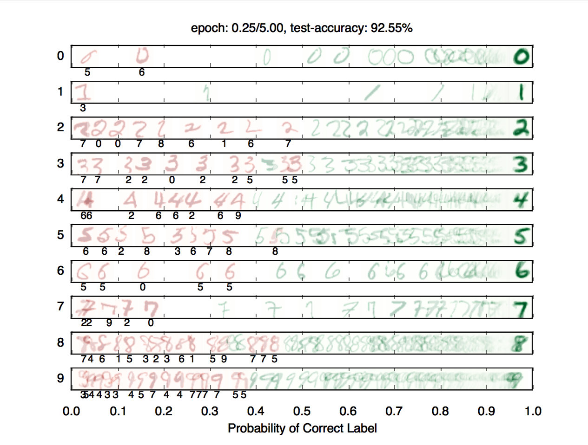
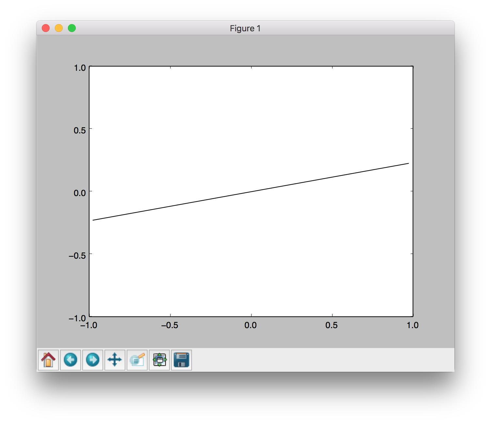
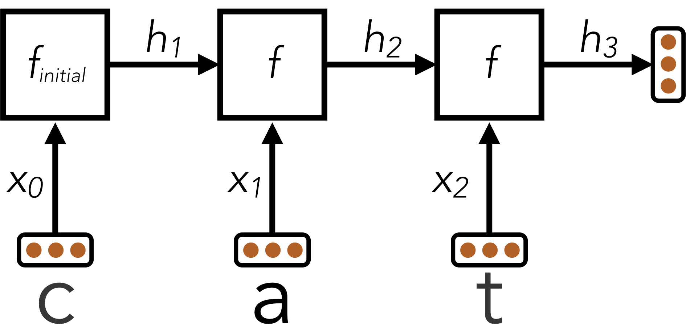

# Lab exercises: Machine Learning

<p align="center">
  
</p>

Code: [Link](./code.zip)

------


## Introduction

This project will be an introduction to machine learning; you will build a neural network to classify digits, and more!

| **Files you'll edit:**               |                                                              |
| ------------------------------------ | ------------------------------------------------------------ |
| `models.py`                          | Perceptron and neural network models for a variety of applications. |
| **Files you might want to look at:** |                                                              |
| `nn.py`                              | Neural network mini-library.                                 |
| **Supporting files you can ignore:** |                                                              |
| `autograder.py`                      | Project autograder.                                          |
| `backend.py`                         | Backend code for various machine learning tasks.             |
| `data`                               | Datasets for digit classification and language identification. |


In this project, you will be using Pytorch, which is often used in practical applications of neural networks due to its efficiency and ease of use. 

## Installation

If the following runs and you see the below window pop up where a line segment spins in a circle, you can skip this section. You should use the conda environment for this since conda comes with the libraries we need.

```
python autograder.py --check-dependencies
```




For this project, you will need to install the following two libraries:

- [numpy](https://numpy.org/), which provides support for fast, large multi-dimensional arrays.
- [matplotlib](https://matplotlib.org/), a 2D plotting library.

If you have a conda environment, you can install both packages on the command line by running:

```
conda activate [your environment name]
```


```
pip install numpy
pip install matplotlib
```


You will not be using these libraries directly, but they are required in order to run the provided code and autograder.

If your setup is different, you can refer to numpy and matplotlib installation instructions. You can use either `pip` or `conda` to install the packages; `pip` works both inside and outside of conda environments.

After installing, try the dependency check.

If you choose the alternative project option, you must also download. We recommend using a conda environment if you have one. Pytorch can then be installed as follows:

```
conda activate [your environment name]
pip install numpy
```


You can then follow the instructions here: [Pytorch](https://pytorch.org/) to download the latest version of Pytorch using either Conda or Pip. If you haven’t used Pytorch before, please use the CPU version. The CPU version of Pytorch is the least likely to cause any bugs or complications.

------

# Graded Homework

---

## Provided Code (Part I)

If you are using the pytorch version of this project, here are a the main functions you should be using. This list is not exhaustive, we have imported all the functions you may use in models.py and encourage you to look at the pytorch documentation for additional guidelines on how you should use them.

- `tensor()`: Tensors are the primary data structure in pytorch. They work very similarly to Numpy arrays in that you can add and multiply them. Anytime you use a pytorch function or feed an input into a neural network, you should try to make sure that your input is in the form of a tensor. You can change a python list to a tensor as such: `tensor(data)` where `data` is your n-dimentional list.
- `relu(input)`: The pytorch relu activation is called as such: `relu(input)`. It takes in an input, and returns `max(input, 0)`.
- `Linear`: Use this class to implement a linear layer. A linear layer takes the dot product of a vector containing your weights, and the input. You must initialize this in your `__init__` function like so: `self.layer = Linear(length of input vector, length of output vector)` and call it as such when running your model: `self.layer(input)`. When you define a linear layer like this, Pytorch automatically creates weights and updates them during training.
- `movedim(input_vector, initial_dimension_position, final_dimension_position)`: This function takes in a matrix, and swaps the initial_dimension_position(passed in as an int), with final_simension_position. This will be helpful in question 3.
- `cross_entropy(prediction, target)`: This function should be your loss function for any classification tasks(Questions 3-5). The further away your prediction is from the target, the higher a value this will return.
- `mse_loss(prediction, target)`: This function should be your loss function for any regression tasks(Question 2). It can be used in the same way as cross_entropy.

All the data in the pytorch version will be provided to you in the form of a pytorch `dataset` object, which you will be transforming into a pytorch `dataloader` in order to help you easily create batch sizes.

```
>>> data = DataLoader(training_dataset, batch_size = 64)
>>> for batch in data:
>>>   #Training code goes here
```


For all of these questions, every batch returned by the DataLoader will be a dictionary in the form: `{‘x’:features, ‘label’:label}` with label being the value(s) we want to predict based off of the features.

------

## Q1: Perceptron

Before starting this part, be sure you have `numpy` and `matplotlib` installed!

In this part, you will implement a binary perceptron. Your task will be to complete the implementation of the `PerceptronModel` class in `models.py`.

For the perceptron, the output labels will be either `1` or `−1`, meaning that data points `(x, y)` from the dataset will have `y` be a `torch.Tensor` that contains either `1` or `−1` as its entries.

Your tasks are to:

- Fill out the `init(self, dimensions)` function. This should initialize the weight parameter in `PerceptronModel`. Note that here, you should make sure that your weight variable is saved as a `Parameter()` object of dimension `1` by `dimensions`. This is so that our autograder, as well as pytorch, recognize your weight as a parameter of your model.
- Implement the `run(self, x)` method. This should compute the dot product of the stored weight vector and the given input, returning an `Tensor` object.
- Implement `get_prediction(self, x)`, which should return `1` if the dot product is non-negative or `−1` otherwise.
- Write the `train(self)` method. This should repeatedly loop over the data set and make updates on examples that are misclassified. When an entire pass over the data set is completed without making any mistakes, 100% training accuracy has been achieved, and training can terminate.
- Luckily, Pytorch makes it easy to run operations on tensors. If you would like to update your weight by some tensor `direction` and a constant `magnitude`, you can do it as follows: `self.w += direction * magnitude`

For this question, as well as all of the remaining ones, every batch returned by the DataLoader will be a dictionary in the form: {‘x’:features, ‘label’:label} with label being the value(s) we want to predict based off of the features.

To test your implementation, run the autograder:

```
python autograder.py -q q1
```


**Note**: the autograder should take at most 20 seconds or so to run for a correct implementation. If the autograder is taking forever to run, your code probably has a bug.

------

## Neural Network Tips

In the remaining parts of the project, you will implement the following models:

- Q2: Non-linear Regression
- Q3: Handwritten Digit Classification
- Q4: Language Identification

### Building Neural Nets

Throughout the applications portion of the project, you’ll use the Pytorch framework to create neural networks and solve a variety of machine learning problems. A simple neural network has linear layers, where each linear layer performs a linear operation (just like perceptron). Linear layers are separated by a *non-linearity*, which allows the network to approximate general functions. We’ll use the ReLU operation for our non-linearity, defined as $\text{relu}(x)=\max⁡(x,0)$. For example, a simple one hidden layer/ two linear layers neural network for mapping an input row vector $\mathbf{x}$ to an output vector $\mathbf{f}(\mathbf{x})$ would be given by the function:

$$
\mathbf{f}(\mathbf{x})=\operatorname{relu}\left(\mathbf{x} \cdot \mathbf{W}_{\mathbf{1}}+\mathbf{b}_{\mathbf{1}}\right) \cdot \mathbf{W}_{\mathbf{2}}+\mathbf{b}_{\mathbf{2}}
$$
where we have parameter matrices $\mathbf{W_1}$and $\mathbf{W_2}$ and parameter vectors $\mathbf{b_1}$ and $\mathbf{b_2}$ to learn during gradient descent. $\mathbf{W_1}$ will be an $i \times h$ matrix, where $i$ is the dimension of our input vectors $x$, and $h$ is the hidden layer size. $\mathbf{b_1}$ will be a size $h$ vector. We are free to choose any value we want for the hidden size (we will just need to make sure the dimensions of the other matrices and vectors agree so that we can perform the operations). Using a larger hidden size will usually make the network more powerful (able to fit more training data), but can make the network harder to train (since it adds more parameters to all the matrices and vectors we need to learn), or can lead to overfitting on the training data.

We can also create deeper networks by adding more layers, for example a three-linear-layer net:

$$
\hat{\mathbf{y}}=\mathbf{f}(\mathbf{x})=\operatorname{relu}\left(\operatorname{relu}\left(\mathbf{x} \cdot \mathbf{W}_1+\mathbf{b}_1\right) \cdot \mathbf{W}_2+\mathbf{b}_2\right) \cdot \mathbf{W}_3+\mathbf{b}_3
$$


Or, we can decompose the above and explicitly note the 2 hidden layers:

$$
\begin{gathered}
\mathbf{h}_1=\mathbf{f}_1(\mathbf{x})=\operatorname{relu}\left(\mathbf{x} \cdot \mathbf{W}_{\mathbf{1}}+\mathbf{b}_1\right) \\
\mathbf{h}_{\mathbf{2}}=\mathbf{f}_{\mathbf{2}}\left(\mathbf{h}_{\mathbf{1}}\right)=\operatorname{relu}\left(\mathbf{h}_{\mathbf{1}} \cdot \mathbf{W}_{\mathbf{2}}+\mathbf{b}_{\mathbf{2}}\right) \\
\hat{\mathbf{y}}=\mathbf{f}_{\mathbf{3}}\left(\mathbf{h}_{\mathbf{2}}\right)=\mathbf{h}_{\mathbf{2}} \cdot \mathbf{W}_{\mathbf{3}}+\mathbf{b}_{\mathbf{3}}
\end{gathered}
$$


Note that we don't have a relu at the end because we want to be able to output negative numbers, and because the point of having relu in the first place is to have non-linear transformations, and having the output be an affine linear transformation of some nonlinear intermediate can be very sensible.

### Batching

For efficiency, you will be required to process whole batches of data at once rather than a single example at a time. This means that instead of a single input row vector $\mathbf{x}$ with size $i$, you will be presented with a batch of $b$ inputs represented as a $b\times i$ matrix $\mathbf{X}$. We provide an example for linear regression to demonstrate how a linear layer can be implemented in the batched setting.

### Randomness

The parameters of your neural network will be randomly initialized, and data in some tasks will be presented in shuffled order. Due to this randomness, it’s possible that you will still occasionally fail some tasks even with a strong architecture – this is the problem of local optima! This should happen very rarely, though – if when testing your code you fail the autograder twice in a row for a question, you should explore other architectures.

### Designing Architecture

Designing neural nets can take some trial and error. Here are some tips to help you along the way:

- Be systematic. Keep a log of every architecture you’ve tried, what the hyperparameters (layer sizes, learning rate, etc.) were, and what the resulting performance was. As you try more things, you can start seeing patterns about which parameters matter. If you find a bug in your code, be sure to cross out past results that are invalid due to the bug.
- Start with a shallow network (just one hidden layer, i.e. one non-linearity). Deeper networks have exponentially more hyperparameter combinations, and getting even a single one wrong can ruin your performance. Use the small network to find a good learning rate and layer size; afterwards you can consider adding more layers of similar size.
- If your learning rate is wrong, none of your other hyperparameter choices matter. You can take a state-of-the-art model from a research paper, and change the learning rate such that it performs no better than random. A learning rate too low will result in the model learning too slowly, and a learning rate too high may cause loss to diverge to infinity. Begin by trying different learning rates while looking at how the loss decreases over time.
- Smaller batches require lower learning rates. When experimenting with different batch sizes, be aware that the best learning rate may be different depending on the batch size.
- Refrain from making the network too wide (hidden layer sizes too large) If you keep making the network wider accuracy will gradually decline, and computation time will increase quadratically in the layer size – you’re likely to give up due to excessive slowness long before the accuracy falls too much. The full autograder for all parts of the project takes ~12 minutes to run with staff solutions; if your code is taking much longer you should check it for efficiency.
- If your model is returning `Infinity` or `NaN`, your learning rate is probably too high for your current architecture.
- Recommended values for your hyperparameters:
  - Hidden layer sizes: between 100 and 500.
  - Batch size: between 1 and 128. For Q2 and Q3, we require that total size of the dataset be evenly divisible by the batch size.
  - Learning rate: between 0.0001 and 0.01.
  - Number of hidden layers: between 1 and 3(It’s especially important that you start small here).

------

## Example: Linear Regression

As an example of how the neural network framework works, let’s fit a line to a set of data points. We’ll start four points of training data constructed using the function $y=7x_0 + 8x_1+3$. In batched form, our data is:

$$\mathbf{X} = \begin{bmatrix} 0 & 1 \\\ 0 & 1 \\\ 1 & 0 \\\ 1 & 1 \end{bmatrix}$$

$$\mathbf{Y} = \begin{bmatrix} 3 \\\ 11 \\\ 10 \\\ 18  \end{bmatrix}$$

Suppose the data is provided to us in the form of `Tensor`s.

```
>>> x
torch.Tensor([[0,0],[0,1],[1,0],[1,1])
>>> y
torch.Tensor([[3],[11],[10],[18]])
```


Let’s construct and train a model of the form $f(x)=x_0 m_0 + x_1m_1+b$. If done correctly, we should be able to learn that $m_0=7$, $m_1=8$, and $b=3$.

First, we create our trainable parameters. In matrix form, these are:

$$\mathbf{M} = \begin{bmatrix} m_0 \\\ m_1 \end{bmatrix}$$

$$\mathbf{B} = \begin{bmatrix} b \end{bmatrix}$$

Which corresponds to the following code:

```
m = Tensor(2, 1)
b = Tensor(1, 1)
```


A minor detail to remember is that tensors get initialized with all 0 values unless you initialize the tensor with data. Thus, printing them gives:

```
>>> m
torch.Tensor([[0],[0]])
>>> b
torch.Tensor([[0]])
```


Next, we compute our model’s predictions for y. If you’re working on the pytorch version, you must define a linear layer in your `__init__()` function as mentioned in the definition that is provided for `Linear` above.:

```
predicted_y = self.Linear_Layer(x)
```


Our goal is to have the predicted y*y*-values match the provided data. In linear regression we do this by minimizing the square loss:

$$
\mathcal{L}=\frac{1}{2 N} \sum_{(\mathbf{x}, y)}(y-f(\mathbf{x}))^2
$$

We calculate our loss value:

```
loss = mse_loss(predicted_y, y)
```


Finally, after defining your neural network, In order to train your network, you will first need to initialize an optimizer. Pytorch has several built into it, but for this project use: `optim.Adam(self.parameters(), lr=lr)` where `lr` is your learning rate. Once you’ve defined your optimizer, you must do the following every iteration in order to update your weights:

- Reset the gradients calculated by pytorch with `optimizer.zero_grad()`
- Calculate your loss tensor by calling your `get_loss()` function
- Calculate your gradients using `loss.backward()`, where `loss` is your loss tensor returned by `get_loss`
- And finally, update your weights by calling `optimizer.step()`

You can look at the [official pytorch documentation](https://pytorch.org/docs/stable/optim.html) for an example of how to use a pytorch optimizer().

------

## Q2: Non-linear Regression

For this question, you will train a neural network to approximate $sin⁡(x)$ over $[−2\pi,2\pi]$.

You will need to complete the implementation of the `RegressionModel` class in `models.py`. For this problem, a relatively simple architecture should suffice (see <u>Neural Network Tips</u> for architecture tips). Use `nn.SquareLoss`(original) or `mse_loss`(pytorch) as your loss.

Your tasks are to:

- Implement `RegressionModel.__init__` with any needed initialization.
- Implement `RegressionModel.run`(`RegressionModel.forward` in pytorch) to return a `batch_size` by `1` node that represents your model’s prediction.
- Implement `RegressionModel.get_loss` to return a loss for given inputs and target outputs.
- Implement `RegressionModel.train`, which should train your model using gradient-based updates.

There is only a single dataset split for this task (i.e., there is only training data and no validation data or test set). Your implementation will receive full points if it gets a loss of 0.02 or better, averaged across all examples in the dataset. You may use the training loss to determine when to stop training (If you’re using the original version, use `nn.as_scalar` to convert a loss node to a Python number). Note that it should take the model a few minutes to train.

```
python autograder.py -q q2
```


------

## Q3: Digit Classification

For this question, you will train a network to classify handwritten digits from the MNIST dataset.

Each digit is of size `28` by `28` pixels, the values of which are stored in a `784`-dimensional vector of floating point numbers. Each output we provide is a `10`-dimensional vector which has zeros in all positions, except for a one in the position corresponding to the correct class of the digit.

Complete the implementation of the `DigitClassificationModel` class in `models.py`. The return value from `DigitClassificationModel.run()` should be a `batch_size` by `10` node containing scores, where higher scores indicate a higher probability of a digit belonging to a particular class (0-9). You should use `nn.SoftmaxLoss`(or `cross_entropy` if you’re using pytorch) as your loss. Do not put a ReLU activation in the last linear layer of the network.

For both this question and Q4, in addition to training data, there is also validation data and a test set. You can use `dataset.get_validation_accuracy()` to compute validation accuracy for your model, which can be useful when deciding whether to stop training. The test set will be used by the autograder.

To receive points for this question, your model should achieve an accuracy of at least 97% on the test set. For reference, our staff implementation consistently achieves an accuracy of 98% on the validation data after training for around 5 epochs. Note that the test grades you on test accuracy, while you only have access to validation accuracy – so if your validation accuracy meets the 97% threshold, you may still fail the test if your test accuracy does not meet the threshold. Therefore, it may help to set a slightly higher stopping threshold on validation accuracy, such as 97.5% or 98%.

To test your implementation, run the autograder:

```
python autograder.py -q q3
```

---

# Optional (not graded)

------

## Q4: Language Identification

Language identification is the task of figuring out, given a piece of text, what language the text is written in. For example, your browser might be able to detect if you’ve visited a page in a foreign language and offer to translate it for you. Here is an example from Chrome (which uses a neural network to implement this feature):


In this project, we’re going to build a smaller neural network model that identifies language for one word at a time. Our dataset consists of words in five languages, such as the table below:

| **Word**  | **Language** |
| --------- | ------------ |
| discussed | English      |
| eternidad | Spanish      |
| itseänne  | Finnish      |
| paleis    | Dutch        |
| mieszkać  | Polish       |

Different words consist of different numbers of letters, so our model needs to have an architecture that can handle variable-length inputs. Instead of a single input $x$ (like in the previous questions), we’ll have a separate input for each character in the word: $x_0, x_1, ... ,x_{L−1}$ where $L$ is the length of the word. We’ll start by applying a network $f_{\text{initial}}$ that is just like the networks in the previous problems. It accepts its input $x_0$ and computes an output vector $h_1$ of dimensionality $d$:

$$
h_1=f_{\text{initial}}(x_0)
$$
Next, we’ll combine the output of the previous step with the next letter in the word, generating a vector summary of the the first two letters of the word. To do this, we’ll apply a sub-network that accepts a letter and outputs a hidden state, but now also depends on the previous hidden state $h_1$. We denote this sub-network as $f$.
$$
h_2=f(h_1,x_1)
$$


This pattern continues for all letters in the input word, where the hidden state at each step summarizes all the letters the network has processed thus far:
$$
h_3=f(h_2,x_2) \\
\dots
$$


Throughout these computations, the function $f(\cdot,\cdot)$ is the same piece of neural network and uses the same trainable parameters; $f_\text{initial}$ will also share some of the same parameters as $f(\cdot,\cdot)$. In this way, the parameters used when processing words of different length are all shared. You can implement this using a for loop over the provided inputs `xs`, where each iteration of the loop computes either $f_\text{initial}$ or $f$.

The technique described above is called a Recurrent Neural Network (RNN). A schematic diagram of the RNN is shown below:



Here, an RNN is used to encode the word “cat” into a fixed-size vector $h_3$.

After the RNN has processed the full length of the input, it has encoded the arbitrary-length input word into a fixed-size vector $h_L$, where $L$ is the length of the word. This vector summary of the input word can now be fed through additional output transformation layers to generate classification scores for the word’s language identity.

### Batching

Although the above equations are in terms of a single word, in practice you must use batches of words for efficiency. For simplicity, our code in the project ensures that all words within a single batch have the same length. In batched form, a hidden state $h_i$ is replaced with the matrix $H_i$ of dimensionality `batch_size` by `d`.

### Design Tips

The design of the recurrent function $f(\cdot,\cdot)$ is the primary challenge for this task. Here are some tips:

- Start with an architecture $f_\text{initial}(x)$ of your choice similar to the previous questions, as long as it has at least one non-linearity.
- You should use the following method of constructing $f(\cdot, \cdot)$given $f_\text{initial(x)}$. The first transformation layer of $f_\text{initial(x)}$ will begin by multiplying the vector $x_0$ by some weight matrix $Wx$ to produce $z_0 = x_0 \cdot W_x$. For subsequent letters, you should replace this computation with $z_i = x_i \cdot W x + h_i \cdot W_\text{hidden}$ using an `nn.Add` operation. In other words, you should replace a computation of the form `z0 = nn.Linear(x, W)` with a computation of the form `z = nn.Add(nn.Linear(x, W), nn.Linear(h, W_hidden))`(`self.Layer1(x) + self.Layer2(x)` in pytorch).
- If done correctly, the resulting function $f(x_i,h_i)=g(z_i)=g(z_{xi},h_i)$ will be non-linear in both x*x* and $h$.
- The hidden size `d` should be sufficiently large.
- Start with a shallow network for $f$, and figure out good values for the hidden size and learning rate before you make the network deeper. If you start with a deep network right away you will have exponentially more hyperparameter combinations, and getting any single hyperparameter wrong can cause your performance to suffer dramatically.

### Your task

Complete the implementation of the `LanguageIDModel` class.

To receive full points on this problem, your architecture should be able to achieve an accuracy of at least 81% on the test set.

To test your implementation, run the autograder:

```
python autograder.py -q q4
```


**Disclaimer**: This dataset was generated using automated text processing. It may contain errors. It has also not been filtered for profanity. However, our reference implementation can still correctly classify over 89% of the validation set despite the limitations of the data. Our reference implementation takes 10-20 epochs to train.

------

## Q5: Convolutional Neural Networks

The following question is worth 1 point of extra credit.

Oftentimes when training a neural network, it becomes necessary to use layers more advanced than the simple Linear layers that you’ve been using. One common type of layer is a Convolutional Layer. Convolutional layers make it easier to take spatial information into account when training on multi-dimensional inputs. For example, consider the following Input:

$$
\text { Input }=\left[\begin{array}{ccccc}
x_{11} & x_{12} & x_{13} & \ldots & x_{1 n} \\
x_{21} & x_{22} & x_{23} & \ldots & x_{2 n} \\
\vdots & \vdots & \vdots & \ddots & \vdots \\
x_{d 1} & x_{d 2} & x_{d 3} & \ldots & x_{d n}
\end{array}\right]
$$


If we were to use a linear layer, similar to what was done in Question 2, in order to feed this input into your neural network you would have to flatten it into the following form:

$$
\text { Input }=\left[\begin{array}{lllll}
x_{11} & x_{12} & x_{13} & \ldots & x_{1 n} \ldots x_{d n}
\end{array}\right]
$$


But in some problems, such as image classification, it's a lot easier to recognize what an image is if you are looking at the original 2-dimentional form. This is where Convolutional layers come in to play.

Rather than having a weight be a 1-dimentional vector, a 2d Convolutional layer would store a weight as a 2 d matrix:

$$
\text { Weights }=\left[\begin{array}{ll}
w_{11} & w_{12} \\
w_{21} & w_{22}
\end{array}\right]
$$


And when given some input, the layer then convolves the input matrix with the output matrix. After doing this, a Convolutional Neural Network can then make the output of a convolutional layer 1-dimensional and passes it through linear layers before returning the final output.

A 2d convolution can be defined as follows:

$$
\text { Output }=\left[\begin{array}{ccccc}
a_{11} & a_{12} & a_{13} & \ldots & a_{1 n} \\
a_{21} & a_{22} & a_{23} & \ldots & a_{2 n} \\
\vdots & \vdots & \vdots & \ddots & \vdots \\
a_{d 1} & a_{d 2} & a_{d 3} & \ldots & a_{d n}
\end{array}\right]
$$

Where $a_{ij}$ is created by performing an element wise multiplication of the Weights matrix and the section of the input matrix that begins at $x_{ij}$ and has the same width and height as the Weights matrix. We then take the sum of the resulting matrix to calculate $a_{ij}$. For example, if we wanted to find $a_{22}$, we would multiply Weights by the following matrix:
$$
\left[\begin{array}{ll}
x_{22} & x_{23} \\
x_{32} & x_{33}
\end{array}\right]
$$
to get
$$
\left[\begin{array}{ll}
x_{22} * w_{11} & x_{23} * w_{12} \\
x_{32} * w_{21} & x_{33} * w_{22}
\end{array}\right]
$$
before taking the sum of this matrix $a_{22}=x_{22}∗w_{11}+x_{23}∗w_{12}+x_{32}∗w_{21}+x_{33}∗w_{22}$

Sometimes when applying a convolution, the Input matrix is padded with $0$'s to ensure that the output and input matrix can be the same size. However, in this question that is not required. As a result, your output matrix should be smaller than your input matrix.

Your task is to first fill out the Convolve function in `models.py`. This function takes in an input matrix and weight matrix, and Convolves the two. Note that it is guaranteed that the input matrix will always be larger than the weights matrix and will always be passed in one at a time, so you do not have to ensure your function can convolve multiple inputs at the same time.

After doing this, complete the DigitConvolutionalModel() class in `models.py`. You can reuse much of your code from question 3 here.

The autograder will first check your convolve function to ensure that it correctly calculates the convolution of two matrices. It will then test your model to see if it can achieve and accuracy of 80% on a greatly simplified subset MNIST dataset. Since this question is mainly concerned with the Convolve() function that you will be writing, your model should train relatively quick.

In this question, your Convolutional Network will likely run a bit slowly, this is to be expected since packages like Pytorch have optimizations that they use to speed up convolutions. However, this should not affect your final score since we provide you with an easier version of the MNIST dataset to train on.

Model Hints: We have already implemented the convolutional layer and flattened it for you. You can now treat the flattened matrix as you would a regular 1-dimensional input by passing it through linear layers. You should only need a couple of small layers in order to achieve an accuracy of 80%.


