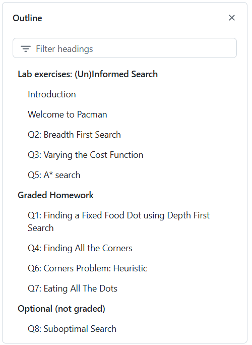

# Artificial Intelligence - Labs

## Contents

- Weeks 1 - 3 **[Search - Project 1] (33%)**:

  1. Uninformed search / informed search
  
  
    2. Adversarial search
    2. Constraint Satisfaction Problems
  

- Weeks 4 - 6 **[Uncertainty - Project 2] (33%)**: 
  1. Bayesian networks
  2. Hidden Markov Models

- Weeks 7 - 11 **[Learning - Project 3] (33%)**:
  1. Naive Bayes, decision trees, k-means
  2. Perceptron, Logistic regression, MLP
  3. Artificial Neural Networks: CNN; backprop
  4. Reinforcement Learning

## Grading total course: 

- Exam (75%) 
- 3 Projects (25%)

## Class structure

Starting from lab 2, the labs are slit into two parts:

- **Hour 1** (Optional QnA)
  - Time to continue working on your project, and ask for questions/tips when stuck.
  - Starts at **13:45**.

- **Hour 2** Conventional Lab:
  - We do exercises together.
  - Starts at **14:45**.
  

**Example lab session:**

- We make a few exercises together in class (e.g. see *"Lab exercises"* in the image below). These are not graded.

- The exercises under the *"Graded Homework"* section are part of your project. It is **highly recommended** to solve these exercises before the next lab session. 

  Succeeded? 

  - Yes? Great, you can come an hour later to next week's lab session. 
  - No? No worries, you can continue on them in next week's lab practical (hour 1) and ask for questions or tips if needed.

**Tips:**

- Each project will consist of exercises from ~3 lab sessions. Please, start working on them immediately after the lab session, so that the workload is nicely distributed over the semester and you have the option to ask questions during the Q&A sessions.
- The project exercises can be dependent on the exercises made in the labs. Make sure you make good notes during the lab session as **<u>lab-exercise-solutions are not published</u>** due to legal reasons.

---

## Projects

### Project 1 - Search

- Graded homework from labs:
  - [01 search](https://github.com/fdenoodt/UA-Artificial-Intelligence-Labs/tree/32387007%2BoBoii@users.noreply.github.com/01%20search)
  - [02 adversarial search](https://github.com/fdenoodt/UA-Artificial-Intelligence-Labs/tree/32387007%2BoBoii@users.noreply.github.com/02%20adversarial%20search)
  - [03 constraint satisfaction problems](https://github.com/fdenoodt/UA-Artificial-Intelligence-Labs/tree/32387007%2BoBoii@users.noreply.github.com/03%20constraint%20satisfaction%20problems)

- **Deadline**: Sunday 27th of October at 23:59.

- Submission details will follow later.

### Project 2 - Uncertainty

- To be determined.

### Project 3 - Learning

- To be determined.
